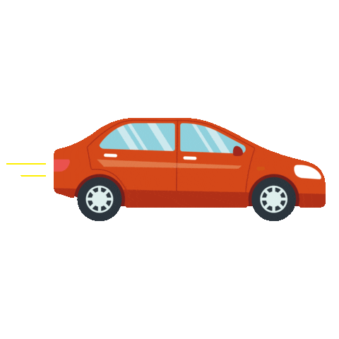

# myproject
<!DOCTYPE html>
<html>
<head> <title>  my website </title> </head>

<body bgcolor="lightgrey">

<h1> This is Style attribute</h1>

It will add style property in element

<h1>HTML Paragraph</h1>

HTML paragraph or HTML p tag is used to define a paragraph in a webpage. Let's take a simple example to see how it work. It is a notable point that a browser itself add an empty line before and after a paragraph. An HTML p tag indicates starting of new paragraph.

<h1>Heading no. 1</h1>  
<h2>Heading no. 2</h2>  
<h3>Heading no. 3</h3>  
<h4>Heading no. 4</h4>  
<h5>Heading no. 5</h5>  
<h6>Heading no. 6</h6>

<h2> Use of line break with pragraph tag</h2>  
        
 Papa and mama, and baby and Dot,  
     		 Willie and me?the whole of the lot  
             Of us all went over in Bimberlie's sleigh,  
              To grandmama's house on Christmas day.  
          
  

 an <abbr title="its academy">its </abbr> this is a abbreviation tag 

 
<form>
    <label> select file to upload: </label>
    <input type= "file"name = "newfile">
    <input type= "image" src="button.jpg" width="100px">
</form>

 

<form>
    <label> Enter your name </label>  
    <input type= "text"name="name" placeholder="Your name">    
    <label> Enter your Email address </label>  
    <input type="email"name="email"placeholder="example@gmail.com">    
    <label> Enter your password </label>  
    <input type="password"name="pass"placeholder="your password">    
    <input type="submit" value="login">
</form>

<h2> Remove the Iframe Border </h2>

 This iframe example doesn't have any border 

<iframe src="khushi1.html" style="border: none"> </iframe>

 
<iframe src="khushi1.html" height="400" width="600"> </iframe>

   

<marquee behavior="scroll"> Welcome to ITS Academy Sharanpur...!!</marquee>

<marquee behavior="slide"> Welcome to ITS Academy Sharanpur...!!</marquee>

<marquee behavior="alternate"> Welcome to ITS Academy Sharanpur...!!</marquee>

<marquee direction="right"> </marquee>

   

   

<marquee direction="right">
    This is an example of a  right direction marquee...
</marquee>  
 

<form>
    <label>Enter your name</label>   
        <input type="text" name="name" placeholder="Your name">    
            <label>Enter your Email address</label>   
        <input type="email" name="email" placeholder="example@gmail.com">    
            <label>Enter your password</label>   
        <input type="password" name="pass" placeholder="your password">    
        <input type="submit" value="login">

</form>

 

<iframe src="Koala.jpg" height="400" width="600"/> </iframe>

<iframe src="khushi1.html" height="400" width="700" style="border: none;" /> </iframe>
<iframe src="robot2.html" height="400" width="600"></iframe>
 
<marquee> Welcome to ITS Academy.......!</marquee>

 
<marquee width="100%" behavior="slide" bgcolor="pink"> this is a example of slide attribute </marquee>
 
<h2 style="color:green;">responsive image</h2>
 
 
<h1>by using the max-width</h1>

 

 This is Not resposive..

 
<h1 style="font-size: 10vw;color: orange;">here size is 10vw. resposive text</h1>

this is a paragraph

here size is 4vw

<h1> DIV example: </h1>

 my name is Amit Kumar. I am learning HTML from ITS Academy Saharanpur. 

 my name is Amit Kumar. I am learning HTML from ITS Academy Saharanpur. 

 my name is Amit Kumar. I am learning HTML from ITS Academy Saharanpur. 

 my name is Amit Kumar. I am learning HTML from ITS Academy Saharanpur. 

 my name is Amit Kumar. I am learning HTML from ITS Academy Saharanpur. 

 
<audio controls>
    <source src="C:\Users\pc\Downloads\izhar-hua.mp3" type="audio/mp3">
</audio> 
<audio controls>
    <source src="C:\Users\pc\Downloads\izhar-hua.mp3" type="audio/mp3">
</audio> 
<audio controls>
    <source src="C:\Users\pc\Downloads\izhar-hua.mp3" type="audio/mp3">
</audio>

 

<video controls autoplay>
    <source src="C:\Users\pc\Downloads\" type="video/mp4">
</video>

 
<table border="1px" style="background-color:yellow;">
    <tr>

        <th rowspan="2">name</th>
        <th colspan="3">marks</th>
    </tr>
    <tr>
       <th>c++</th>
       <th>dsa</th>
       <th>wd</th>
        

    </tr>
    <tr>
         <td>kunal</td>
        <td>30</td>
         <td>30</td>
         <td>30</td>
    </tr>
    <tr>
         <td>ritik</td>
        <td>30</td>
         <td>30</td>
         <td>30</td>
    </tr>
    <tr>
         <td>nikhil</td>
        <td>30</td>
         <td>30</td>
         <td>30</td>

    </tr>
</table>

<table>
    
</table>
 
 

<svg width="200" height="100">  
<rect width="200" height="100" stroke="yellow" stroke-width="4" fill="red" />  
<text x="40" y="60">Welcome to ITS </text>
</svg>

 
<svg width="100" height="100">  
<circle cx="50" cy="50" r="40" stroke="yellow" stroke-width="4" fill="pink" />
<text x="30" y="60" style="font-size: 30px;"> ITS </text>  
</svg>

</body>
</html>
 
